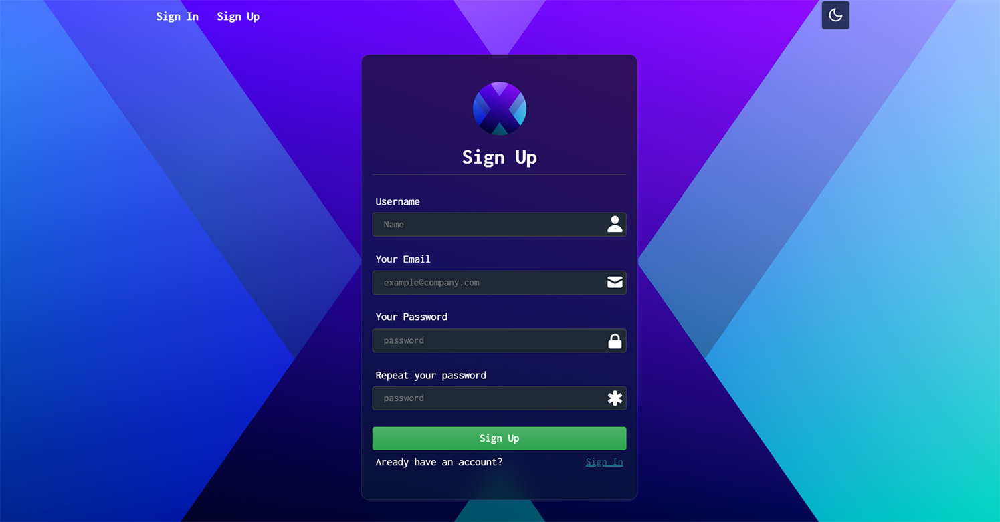

# Login Frontend

## Introduction

I created this project during my schooltime to create a login page. In this repository you can find the seperate overlay for this login page. 

## How it was made

The project was created with HTML CSS and JavaScript. 
No libraries or other external resources were used. _(apart from the font)_

The pure CSS background comes from an site that provides beautiful CSS backgrounds. The transparent cards are also made with the help of a external page.

[Nice CSS backgrounds](https://gradienta.io/)

[Stunning transparent cards](https://ui.glass/generator/)

## Features

The project offers an all around good login system layout. When you start the website there is a loader animation so that possible large files can be downloaded in the background. In addition, there is a dark- and lightmode that remains memorized.

## Known issues

The website was tested on Chrome and Edge without any problems. However, on Firefox and Safari there were issues with displaying the svg's.

### Supported browsers

- [x] Google Chrome or Chromium based browsers (Opera, Brave)
- [x] Microsoft Edge
- [x] Firefox _(with one known issue)_ 
- [ ] Safari _(with one known issue)_
- [ ] Internet Explorer _...nahh dont think so_

 ## License

Project is [MIT licensed](./LICENSE)

(<a href="#top"> top </a>)

